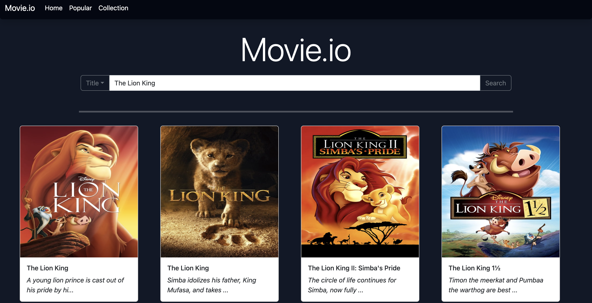

## Table of contents

- [Overview](#overview)
  - [Screenshot](#screenshot)
  - [Links](#links)
- [My process](#my-process)
  - [Built with](#built-with)
  - [What I learned](#what-i-learned)
  - [Continued development](#continued-development)
  - [Useful resources](#useful-resources)
- [Author](#author)
- [Acknowledgments](#acknowledgments)


## Overview

### Screenshot




## My process
    I sketched out a rough draft of what I wanted the structure of the web app to look like once I got an idea. I knew I was going to use bootstrap for most of the webpage's components so I kept that in mind while designing.

    I started with the very basic HTML structure of the page, then used javascript and the TDMB API to get data on the page and complete the web app to its current version.


### How to use:

  This webapp is a dynamic page that uses Vite with vanilla JavaScript. In order to run it properly, download all of the files into one directory. Install vite (I used NPM, but anything works) and run the dev run command for your installation method. 
  See vite docs for more information.

### Built with

- Semantic HTML5 markup
- CSS custom properties
- Flexbox
- CSS Grid
- Mobile-first workflow
- [Bootstrap](https://getbootstrap.com/) - CSS library
- [Vite](https://vitejs.dev/) - Vite


### What I learned

    While the project is not close to its final version, I have learned a lot so far. Specifically, I learned the importance of file strucutre, functional programming, and breaking code files up increase readability and make debugging easier.

    This was also my first time using an API to flesh out a project, so I learned about 


Here is a sample of the HTML code I used to make a mobile-responsive navigation bar using bootstrap. 
```html
 <nav class="navbar navbar-expand-lg shadow rounded mb-4">
      <div class="container-fluid ">
        <a class="navbar-brand text-white" href="./index.html">Movie.io</a>
        <button class="navbar-toggler bg-dark-subtle" type="button" data-bs-toggle="collapse"
          data-bs-target="#navbarNav" aria-controls="navbarNav" aria-expanded="false" aria-label="Toggle navigation">
          <span class="navbar-toggler-icon"></span>
        </button>
        <div class="collapse navbar-collapse" id="navbarNav">
          <ul class="navbar-nav">
            <li class="nav-item">
              <a class="nav-link" aria-current="page" href="./index.html">Home</a>
            </li>
            <li class="nav-item">
              <a class="nav-link " href="./pages/popular.html">Popular</a>
            </li>
            <li class="nav-item">
              <a class="nav-link" href="./pages/collection.html">Collection</a>
            </li>

          </ul>
        </div>


      </div>
    </nav>
```

This CSS is responsible for animating the card "animation"
```css
.card:hover {
    transform: translateY(-5px);
    box-shadow: 10px white;
    background-color: black;
    color: white;
    transition-duration: 0.5s;


}
```

This async function imports another script module and makes an API call to TDMB's api setup.
```js
async function getPopular() {
    axios.get(`${POPULAR_URL}&api_key=${API_KEY}`)
        .then((res) => {
            return res.data.results;
        }).then((results) => {
            document.querySelector(".movie-row-popular").innerHTML = "";
            for (let i = 0; i < 8; i++) {

                generateMovieCard(results[i], ".movie-row-popular");
            }
        })

}

```

### Continued development

This project is not fully completed. In the future, I plan to make the website allow the user to login and store their collection. The website also currently does not allow users to save their favorite movies or add them to a list in any way.
Some future features include more filters for searching, reccomended movies, account creation + login, and more.

### Useful resources

- [MDN Docs](https://developer.mozilla.org/en-US/) - The MDN Docs were incredibly useful for information on JavaScript debugging. A classic source.
- [Postman](https://www.postman.com/) - Another classic source, was very helpful for letting me analyze API call JSON returns.

## Author

- Linkedin - [Sonjay Lake](https://www.linkedin.com/in/sonjay-l-24a4a0126/)
- Twitter - [@Sonjay_Lake](https://twitter.com/Sonjay_Lake)


## Acknowledgments

Thanks to Mohsen Dorparasti on StackOverflow for pointing out such an obvious error.